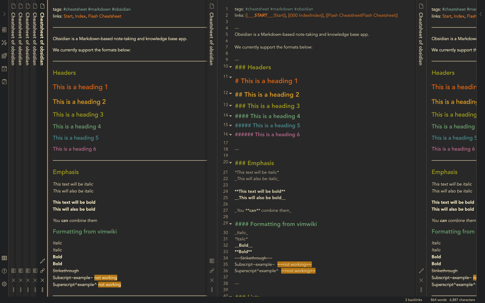
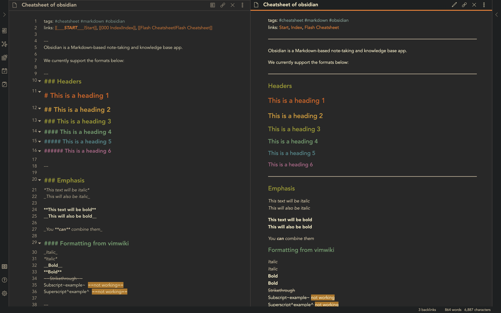

# obsidian_andygruv

This is an [obsidian](https://obsidian.md/) theme combined and modified from two existing themes: [obsidian_gruvbox](https://github.com/insanum/obsidian_gruvbox) and [Comfort-Coda](https://github.com/nickmilo/Comfort-Coda). The [Andy_Matuschak mode](https://notes.andymatuschak.org) is a credit to [death_au](https://github.com/deathau) 's brilliant solution. 

---
### Main improvements:
- Using the color scheme of [gruvbox](https://github.com/morhetz/gruvbox).
- [Andy_Matuschak mode](https://notes.andymatuschak.org) with notes stacked unlimited along the horizontal direction.
- Minimise the spare and useless space between notes.
- Most of the scrollbars are hidden.
- Add a non-transparent background to the graphview mode, so that it won't be distracted from the layer below.
- Compatible to v0.7.1
- Dark mode == Andy mode; Light mode == Normal dark mode

---
### Screenshot

- Dark/Andy Mode:
  

  

- Light Mode:

---
### Usage

- Turn on 'Custom CSS' plugin in Obsidian: `Settings > Plugins >  Custom CSS`.
- Download and copy the  `obsidian.css` file to the vault directory of your Obsidian note. It should take effect immediately.
- Switch between dark and light mode:  `Settings > Apprearance > Theme`.
- Happy writing and have fun!
