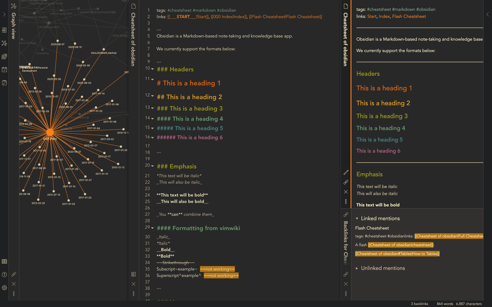
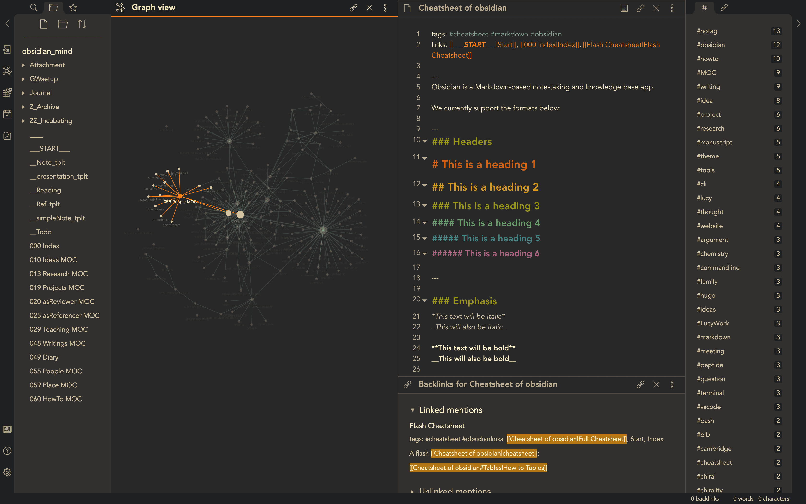

# obsidian_andygruv

This is an [obsidian](https://obsidian.md/) theme combined and modified from two existing themes: [obsidian_gruvbox](https://github.com/insanum/obsidian_gruvbox) and [Comfort-Coda](https://github.com/nickmilo/Comfort-Coda). 

---
### Main improvements:
- Using the color scheme of [gruvbox](https://github.com/morhetz/gruvbox).
- [Andy_Matuschak mode](https://notes.andymatuschak.org) with notes stacked unlimited along the horizontal direction.
- Minimise the spare and useless space between notes.
- Most of the vertical scrollbars are hidden.
- Add a non-transparent background to the graphview mode, so that it won't be distracted from the layer below.
- The side bars are hidden when not being used.

### Known issues:
- Currently, not working well with horizontal notes. But it is fun to try it.

---
### Screenshot

- Dark Mode:

- Light Mode:

---
### Usage

- Download and copy the  `obsidian.css` file to the vault directory of your Obsidian note. It should take effect immediately.
- Turn on 'Custom CSS' plugin in Obsidian: `Settings > Plugins >  Custom CSS`.
- Switch between dark and light mode:  `Settings > Apprearance > Theme`.
- Open more than 3 notes at the same time, you will see the _TRAIN_. 
- Happy writing and have fun!
